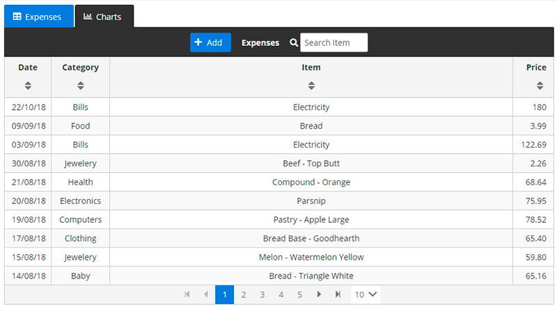

# Expense Tracker

[Live Demo](https://www.wbinkowski.site/et/)

#### CRUD example with PrimeNG datatable with Lazyloading

### Instructions

##### Restore packages

`npm install`

##### Run server

`node ExpenseAPI/server/server.js`

##### Run client

`ng serve`
